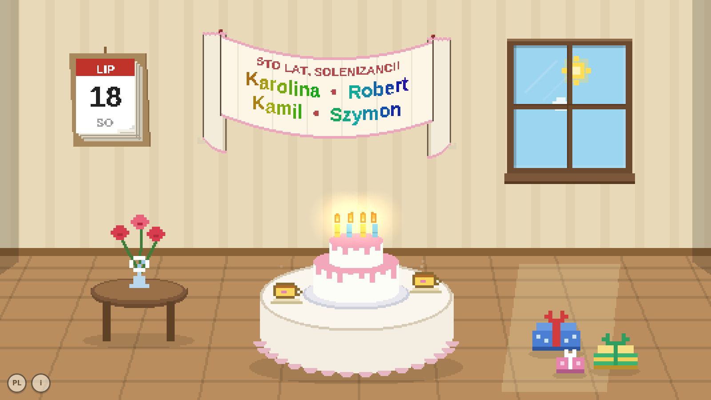

# 🎂 Nameday Party

An ambient celebration room for Polish name days (*imieniny*) — inspired by the
Nintendo DS birthday easter egg, PictoChat, and Animal Crossing birthday parties.



Every day of the year someone is celebrating. The day's *solenizanci* hang on the
banner in rainbow letters, the cake burns one candle per name, tea steams on the
table, and the light in the room follows the real time of day — clouds drift past
the window, golden hour sweeps the floor, and at night the candles become the
only light in the room.


## What's inside

- A full-year Polish name-day calendar — **2,473 names** — every one with its own
  card: origin and etymology (Polish + English), genuinely used diminutives, all
  of the name's dates, and how many living Poles carry it
- The banner shows each day's most popular celebrating names; click one for its
  card. All names are good — the wall calendar opens a browser with every day's
  complete list, and the presents introduce the rare ones
- The cake can be blown out. The calendar pages flutter in the draft. The
  gifts occasionally hop.
- Polish/English toggle (bottom-left), info card on the ⓘ button
- One HTML file plus two data files. No build step, no dependencies, no network.

## Run it

Open `index.html` in a browser — or serve the folder and leave it full-screen on
a spare monitor:

```
python3 -m http.server 8000
```

Useful URL params: `?h=21.5` previews an hour of the day, `?lang=en` forces a
language, `?dev` shows a time-scrubber tray for playing with the light.

## Data

- Name-day calendar: [jancajthaml/polish-name-days](https://github.com/jancajthaml/polish-name-days)
- Name popularity: first-name counts of living persons in the PESEL registry
  (January 2026 snapshot), via [dane.gov.pl](https://dane.gov.pl/pl/dataset/1667)
- Name cards: 50 hand-written entries plus 2,423 model-written ones with a
  fact-checking review pass. Printed name-day calendars vary between publishers,
  and etymology entries may contain mistakes — corrections are very welcome.

Sto lat! 🕯️
